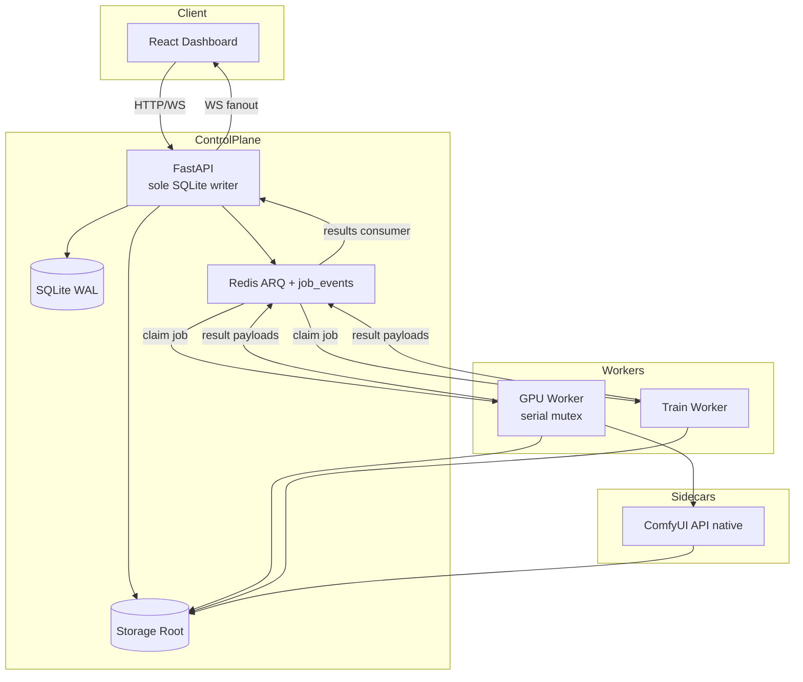
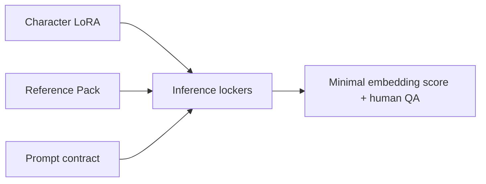
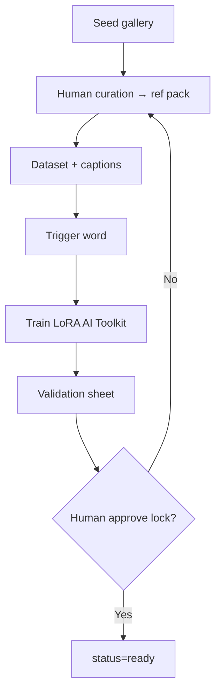
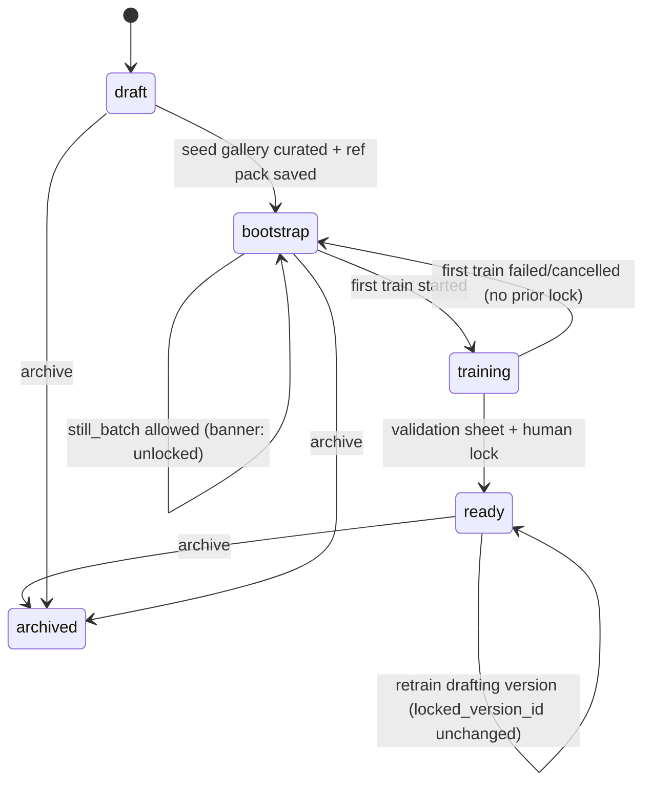
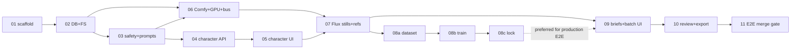

# InstantImpact — Local AI Persona Content Studio

| Field | Value |
|-------|-------|
| **Document** | System Design Document (Greenfield) |
| **Author** | TBD |
| **Date** | 2026-07-27 |
| **Status** | Draft (Rev 3 — re-review fixes) |
| **Target hardware** | NVIDIA L40S 48GB (single GPU) |
| **Reference runtime** | Windows 11 native (Python 3.11+, native ComfyUI, native Redis, no Docker GPU requirement for MVP) |
| **Deployment** | Setup may use network (user-confirmed); **runtime 100% local / offline** |

---

## Frozen MVP definition (single source of truth)

> **MVP ships exactly this vertical slice:**  
> **Character Creator** (appearance, personality, boundaries, 21+ / synthetic safety) → **seed gallery + generate-only reference pack** → **Flux still consistency path (refs + IP-Adapter/PuLID-Flux where available + character LoRA train/lock)** → **batch still generation from content briefs** → **review / rate / approve** → **immutable approved sets + zip export with disclosure sidecars**.  
>  
> **Explicitly out of MVP (MVP+1 / Phase 2):** dual SDXL pipeline, short video (I2V), Ollama captioning, embedding-heavy analytics polish beyond minimal face distance, Fanvue adapters, multi-account, scheduling automation, Kohya fallback (AI Toolkit only in MVP), Postgres.

All sections below (Goals, Phase 1, Key Decisions, feature flags, PR plan) **must match this paragraph**. If anything conflicts, this box wins.

---

## Overview

InstantImpact is a fully local **AI Persona Content Studio** for designing **synthetic adult personas** and generating highly consistent still images (and, later, short videos and personality-matched captions). It targets creators who need character consistency across hundreds of assets (e.g. Fanvue-style workflows) without sending images, prompts, or models to the cloud at runtime.

The system centers on a **Character** as the primary domain object: appearance references, trained LoRA weights, identity embeddings, personality/voice profile, and safety locks. A FastAPI control plane + React dashboard orchestrates a **ComfyUI-backed GPU worker** for generation and a **LoRA training pipeline** for character locking. Metadata lives in SQLite (WAL); all media and weights live on the filesystem under a versioned storage root.

**MVP** delivers the frozen vertical slice above. **Post-MVP** adds captions (Ollama), short I2V video, SDXL identity path, automation, scheduling, multi-account packaging, and optional Fanvue export adapters—without rewriting the core character/generation model.

---

## Background & Motivation

### Current state

There is no existing InstantImpact codebase. Creators today typically chain ad-hoc tools:

- ComfyUI or Forge for generation
- Separate Kohya / AI Toolkit runs for LoRAs
- Manual prompt books in spreadsheets
- External caption tools or cloud APIs
- Hand-organized folders for “approved” sets

This produces weak consistency, high operator burden, and no unified character lifecycle.

### Pain points

1. **Face/body drift** across batches without a disciplined LoRA + reference protocol.
2. **No single source of truth** for personality, boundaries, and visual identity.
3. **GPU workflow friction** (manual node graphs, no job queue, no batch briefs).
4. **Caption quality** that does not match a locked character voice (addressed post-MVP).
5. **Compliance risk** if age, synthetic disclosure, or lookalike controls are informal.

### Why now

Local stacks in 2025–2026 make this practical on a single 48GB card:

- **Flux**-class models with strong LoRA tooling
- Evolving **IP-Adapter / PuLID-Flux** (and mature SDXL InstantID stack for later)
- Open **image-to-video** models for a later phase (Wan-class I2V, LTX-Video)
- Local multimodal LLMs via Ollama for a later caption phase

---

## Goals & Non-Goals

### Goals (MVP) — aligned with frozen MVP

| Priority | Goal |
|----------|------|
| **P0** | Extremely strong character consistency (face, body, skin, hair, style) across batches of **stills** |
| **P0** | Runtime **100% local** (no cloud generation or cloud LLMs for core features) |
| **P0** | Character Creator: appearance + personality + boundaries + **21+** + synthetic confirmation |
| **P0** | Consistency Engine: generate-only refs + **Flux** still workflow + **LoRA train → lock** |
| **P0** | Batch still generation from content briefs |
| **P0** | Review, rate, approve/reject + immutable approved sets + zip export + disclosure |
| **P0** | Clean local web UI / dashboard for multi-character management |
| **P0** | Safety gateway on every GPU enqueue path |

### Goals (MVP+1 / Phase 2) — not first ship

| Priority | Goal |
|----------|------|
| **P1** | Automatic captions in character voice (Ollama, offline) |
| **P1** | Short video (5–15s) I2V from approved stills (Wan-class slot) |
| **P1** | SDXL InstantID/PuLID secondary pipeline |
| **P2** | Kohya fallback trainer, embedding analytics polish, automation, Fanvue adapter |

### Non-Goals (MVP)

- Cloud inference or cloud-hosted models of any kind at **runtime**
- Scraping, reverse-image search, or celebrity/lookalike tooling
- Real-person face clone UX (MVP: **generate-only references**; no external photo upload)
- Dual still-pipeline (SDXL) in first ship
- Video generation in first ship
- Caption LLM in first ship
- Full Fanvue API integration (post-MVP adapter only)
- Multi-GPU / cluster orchestration
- Real-time interactive chat avatar / live streaming
- Mobile clients; multi-tenant SaaS

### Constraints (non-negotiable)

- **Runtime:** no cloud generation; optional `STRICT_OFFLINE=true` fails closed on outbound
- **Setup:** network allowed only with **user-confirmed** downloads + checksums
- No real-person recreation tooling (policy + UX; not guaranteed detection)
- Age appearance always clearly adult (**21+**) in schema + prompt builders + **mandatory human gates**
- All content tagged **synthetic**; disclosure always travels with **export** files
- Legal, discreet product framing; adult content only for fictional/synthetic personas

---

## Proposed Design

### 1. Overall system architecture

InstantImpact is a **monorepo** with four runtime roles on one **Windows 11** machine (reference path):

1. **Web UI** (React/Vite) — character design, briefs, review, global GPU status bar
2. **API / Control Plane** (FastAPI) — domain logic, **sole SQLite writer**, safety validation, job enqueue, WebSocket fanout
3. **Workers** (ARQ processes) — GPU generation worker, LoRA training worker (same GPU mutex); workers **do not write SQLite**
4. **Sidecars** — ComfyUI (API mode, native Windows), Redis (native or Memurai-compatible; or Redis via non-GPU Docker)



#### Component responsibilities

| Component | Responsibility |
|-----------|----------------|
| **API** | Characters, briefs, jobs, assets, ratings, safety validation, prompt assembly, **all DB writes**, WebSocket to UI |
| **GPU Worker** | Exactly one active GPU job; drives ComfyUI; writes files to FS; publishes **result events** to Redis |
| **Train Worker** | Dataset already on FS; runs AI Toolkit under GPU lock; writes LoRA files; publishes results |
| **ComfyUI** | Execution engine for Flux stills (MVP); later video/SDXL graphs |
| **Storage** | Characters, refs, datasets, LoRAs, outputs, approved sets, workflow templates, job repro bundles |

Ollama is **not** an MVP sidecar (captions deferred).

#### Worker isolation rule (authoritative)

Workers open **no SQLite connections** (neither read nor write). All work inputs and control signals use **filesystem + Redis only**. The API is the sole process that reads/writes SQLite for domain state.

#### Job enqueue contract (ARQ payload + FS snapshot)

Before enqueuing, the **API** always:

1. Creates `jobs` / `job_items` rows (`status=queued`).
2. Writes an **immutable job snapshot** to the filesystem:
   - `data/jobs/{job_id}/request.json` — full job request (type, preset, character paths, version ids, safety snapshot refs, complete `items[]` with seeds/prompts/params).
   - Item rows are mirrored inside `request.json` so the worker never needs the DB.
3. Clears any prior cancel key: `DEL instantimpact:cancel:{job_id}`.
4. Enqueues ARQ with a **fat-but-stable payload** (not job_id alone):

```json
{
  "v": 1,
  "job_id": "uuid",
  "type": "still_batch | seed_gallery | lora_train | ref_embed",
  "request_path": "jobs/{job_id}/request.json",
  "priority": 10,
  "gpu_required": true
}
```

Worker on claim:

1. Load `request_path` from storage root (required; fail job if missing/unreadable).
2. Treat `request.json` as the sole source of work units (do not re-query API/DB).
3. Optionally use ARQ payload fields only as routing metadata (`type`, `job_id`).

Large blobs (images, LoRAs) are **paths inside** `request.json`, never inlined in Redis.

#### Cancel channel (DB flag + Redis signal)

`POST /jobs/{id}/cancel` (API only):

1. Sets `jobs.cancel_requested=true` and may set terminal intent in SQLite (for UI).
2. **Also** signals the worker (required for cooperative cancel):
   - `SET instantimpact:cancel:{job_id} 1` with TTL (e.g. 24h)
   - `PUBLISH instantimpact:cancel { "job_id": "…" }` (optional fast path)

Worker cooperative cancel checks (no SQLite):

- Between still items / train steps: `EXISTS instantimpact:cancel:{job_id}` (or subscription).
- On detect: stop scheduling further work; finish or abort current unit per job type (see Train / cancel UX); RPUSH `cancelled` / `job_done` result; do **not** clear the cancel key (API may clear after terminal state).

API remains source of truth for `cancel_requested` in SQLite; Redis key is the **worker-visible** signal.

#### Progress bus (worker → API → UI) — implementation contract

1. **API** creates DB rows + FS `request.json`, enqueues ARQ with payload above.
2. **Worker** claims job → acquires GPU lock → runs from `request.json` → writes item files to FS → publishes progress/results to Redis.
3. **Progress channel:** Redis pub/sub `instantimpact:job_events` (also capped list `instantimpact:job_events:{job_id}` for late subscribers).
4. **API results consumer** (async task in API process):
   - BLPOP `instantimpact:job_results` for durable state transitions
   - optional pub/sub for low-latency UI ticks
5. API sole writer applies payloads → SQLite (`job_items`, `assets`, character status rules) and fans out WebSocket `/ws/jobs/{id}`.

**Event schema (JSON):**

```json
{
  "v": 1,
  "job_id": "uuid",
  "ts": "2026-07-27T12:00:00Z",
  "event": "queued | running | item_started | item_done | item_failed | job_done | job_failed | cancelled | log",
  "item_index": 0,
  "item_id": "uuid",
  "asset_id": "uuid | null",
  "thumbnail_path": "relative/path | null",
  "progress_pct": 0,
  "message": "optional human string",
  "consistency_score": null,
  "error_code": null
}
```

**Ordering guarantee for thumbnails:** worker writes PNG + sidecar JSON to FS → fsync → then RPUSH `item_done` with paths → API inserts `assets` row → WS event. UI never receives `item_done` before file exists.

**Single-writer rule:** only the API process mutates `jobs`, `job_items`, `assets`, `characters` status fields related to job completion.

#### GPU worker model (single L40S)

- Global Redis lock key: `instantimpact:gpu` (token + TTL heartbeat; worker renews every 10s; stale lock reclaim after 60s).
- Job types (MVP): `still_batch`, `lora_train`, `ref_embed`, `seed_gallery`.
- Job types (later): `video_clip`, `caption_batch`.
- **No preemption of running GPU work.** Priority only orders the **queue**, not mid-flight jobs.
- ComfyUI kept warm between **still** jobs; **mandatory unload protocol** between different job classes (see §3.4).
- On OOM: see VRAM lifecycle.

```mermaid
sequenceDiagram
  participant U as UI
  participant A as FastAPI
  participant R as Redis
  participant W as GPU Worker
  participant C as ComfyUI
  participant F as Filesystem

  U->>A: POST /briefs/{id}/generate
  A->>A: safety.validate + expand brief
  A->>A: INSERT jobs/job_items queued
  A->>F: write jobs/{id}/request.json
  A->>R: DEL cancel key; ARQ enqueue payload+request_path
  A-->>U: job_id
  R->>W: claim job (payload)
  W->>F: load request.json
  W->>R: acquire GPU lock
  W->>R: RPUSH job_results running
  A->>A: UPDATE job running + WS
  loop each item
    W->>R: EXISTS cancel:{job_id}?
    W->>C: workflow JSON
    C->>F: write PNG + sidecar
    W->>R: RPUSH item_done
    A->>A: INSERT asset + WS
  end
  W->>R: release GPU lock
  W->>R: RPUSH job_done
```

#### Data flow (MVP happy path)

1. Create Character → `draft` (appearance + personality + boundaries + 21+/synthetic).
2. Seed gallery (Flux base + prompt contract) → curate **generate-only** reference pack → `bootstrap`.
3. Build training dataset from curated outputs → train LoRA → `training` → validation sheet → human lock → `ready`.
4. Content Brief → still batch jobs → review/rate/approve → Approved Set → zip export with disclosure.

---

### 2. Recommended tech stack

| Layer | Choice | Rationale |
|-------|--------|-----------|
| **Reference OS** | **Windows 11 native** | Operator machine; L40S workstation path without Docker GPU passthrough dependency |
| **Backend** | Python 3.11+, FastAPI, Pydantic v2, SQLAlchemy 2.x | Async-friendly, standard local AI ops stack |
| **Frontend** | React 18 + Vite + TypeScript + Tailwind + shadcn/ui | Fast local SPA; no SSR requirement |
| **API transport** | REST + WebSocket (job progress) | WS owned by API process |
| **DB** | **SQLite + WAL + busy_timeout=30s**; API sole writer | Zero-ops; see concurrency section |
| **Blobs** | Filesystem under configurable `data/` | DB stores paths + SHA-256 |
| **Job queue** | **Redis + ARQ** | Multi-process workers; progress/results bus |
| **GPU serialization** | Redis lock `instantimpact:gpu` | One L40S = one heavy job |
| **Generation** | **ComfyUI native Windows, API mode** | Ecosystem + template workflows |
| **LoRA training (MVP)** | **Ostris AI Toolkit only** | Flux LoRA UX; Kohya = Phase 2 fallback |
| **Captions** | Deferred (Ollama later) | Not MVP |
| **Video** | Deferred (I2V production **slot**, Wan-class default) | Not MVP |
| **Packaging** | `uv` / Poetry + `dev_up.ps1` | Windows-first bootstrap |
| **Docker** | Optional for Redis only; **not required** for GPU path | Avoid Docker Desktop GPU complexity on Win MVP |

#### Offline vs setup modes

| Mode | Network | Behavior |
|------|---------|----------|
| **Setup / bootstrap** | Allowed with confirmation | `bootstrap_models.py` downloads pinned URLs + verifies SHA-256 from `docs/model_cards.md`; operator acknowledges licenses |
| **Runtime (default)** | Not required | Generation, train, review work offline if models present |
| **STRICT_OFFLINE=true** | Denied | Fail any outbound HTTP from API/worker/bootstrap; health reports offline mode |

Air-gap checklist:

- Models + Comfy custom nodes installed from pin list
- Redis binary or service available offline
- Docker images pre-pulled **only if** used for Redis
- ComfyUI-Manager auto-update **disabled**
- No telemetry endpoints in app code
- Health checks are local process/TCP only (Comfy `127.0.0.1`, Redis localhost)

#### SQLite concurrency

- **WAL mode** enabled on connect; `PRAGMA busy_timeout=30000`.
- **Only the API process** opens SQLite at all for domain operations (read + write pool).
- **Workers: zero SQLite connections** — job work comes from FS `request.json` + ARQ payload; cancel via Redis; results via Redis (see Job enqueue contract / Cancel channel).
- Backup: SQLite online backup API or stop API; document “copy `data/db` only when API stopped or via backup endpoint.”
- Expected DB writers: **1** (API). Expected DB readers: API handlers only (not workers).

#### ComfyUI vs pure Diffusers

| | ComfyUI API | Pure Diffusers |
|--|-------------|----------------|
| **Pros** | Nodes for Flux + identity adapters; visual debug | Cleaner unit tests |
| **Cons** | Pin burden for custom nodes | Reimplement adapters |
| **Decision** | **ComfyUI for generation**; versioned templates + binder |

Rule: application code **never** builds node graphs from scratch at runtime. Load `workflows/*.json`, validate required placeholders, substitute values.

#### Windows reference runtime (supported matrix)

| Component | MVP supported | Notes |
|-----------|---------------|-------|
| OS | Windows 11 x64 | Reference |
| Python | 3.11+ venv | CUDA PyTorch per NVIDIA driver |
| GPU | NVIDIA L40S 48GB | Driver recent enough for CUDA used by Comfy |
| ComfyUI | Native Windows install under `tools/ComfyUI` or user path | `--listen 127.0.0.1 --port 8188` |
| Redis | Memurai / native Redis for Windows / WSL Redis **without** requiring GPU in WSL | Default: localhost:6379 |
| Paths | Store absolute resolved paths in DB; templates use forward-slash normalized paths for Comfy | Binder normalizes |
| Docker GPU | **Unsupported for MVP** | Optional Redis container only |
| Linux headless | **Tier-2** (docs later) | Same architecture; not reference until tested |

`scripts/dev_up.ps1`: start Redis (if needed), ComfyUI, API, worker, web Vite—**Windows native**.

---

### 3. Character consistency strategy (L40S 48GB)

Consistency is layered:



#### 3.1 Flux vs SDXL (MVP decision)

| | Flux + LoRA + refs | SDXL + InstantID/PuLID |
|--|--------------------|------------------------|
| MVP | **Yes — sole still pipeline** | **Deferred MVP+1** |
| Role | Production quality + train path | Later max face-lock / bootstrap alternative |

**Decision:** Ship **Flux only** in MVP. SDXL templates and `preferred_pipeline` remain in schema as optional fields defaulting to `flux`, but no SDXL workflow is required to merge MVP.

Structured appearance data compiles through a **pipeline renderer** (`prompt_engine.render(contract, pipeline="flux")`), not one raw string reused blindly. When SDXL arrives, add `pipeline_params.sdxl` without rewriting Character Creator.

#### 3.2 LoRA training pipeline (P0 for lock)

**Goal:** Curated synthetic refs → character LoRA holding face + body + hair + skin across outfits/poses.



**Dataset guidelines (UI-enforced):**

- 20–40 high-quality images; coverage matrix: face close-up, 3/4, profile, full body, pose variety, 2–3 lighting setups.
- Captions: describe what **varies**; consistent trigger token e.g. `sks_aria_v1` (not a celebrity name).
- MVP captions for training: manual edit + optional simple template fill (full VLM auto-caption = MVP+1).

**Default train targets (Flux / AI Toolkit starting points):**

| Base | Tool | Network | Steps (approx) |
|------|------|---------|----------------|
| Flux | AI Toolkit | dim 16–32, alpha = dim or dim/2 | 1,000–2,500 |

Output: `characters/{id}/versions/{v}/lora/model.safetensors` + `train_config.json` + samples.

#### 3.3 Inference-time locking (MVP Flux path)

1. Base Flux checkpoint (pinned in model_cards).
2. Character LoRA (required for `ready`; optional strength for `bootstrap` previews without LoRA).
3. Canonical appearance prompt from `prompt_engine` (Flux renderer).
4. Reference conditioning: PuLID-Flux and/or IP-Adapter from primary face + body refs (nodes per Workflow Spec).
5. Optional pose ControlNet later—not required MVP.
6. **Minimal consistency score:** if face embedding exists for primary ref, compute distance to output face; store on asset (`null` if no face detected). Used for sort/filter in review when present.

**Reference pack (generate-only in MVP):**

```
characters/{id}/versions/{v}/refs/
  face_primary.png
  face_alt_01.png
  body_front.png
  body_threequarter.png
  embeddings/face_primary.npy
```

No external photo upload in MVP (see Safety).

#### 3.4 VRAM lifecycle and presets

**Protocol (every GPU job):**

1. Acquire `instantimpact:gpu` lock (heartbeat).
2. **Prepare:** ensure job-class model set only:
   - Still: Flux + LoRA + adapter nodes as in template
   - Train: unload Comfy heavy weights if needed; AI Toolkit owns GPU
3. **Run** unit of work.
4. **Reclaim:** ComfyUI free-memory / unload models via documented API or process recycle; `torch` cache clear in train wrapper.
5. Release lock.

**OOM policy:**

1. Catch OOM / Comfy error.
2. Persist repro bundle under `jobs/{id}/` (see Observability).
3. Attempt **one** recovery: full ComfyUI process restart + free VRAM check.
4. Mark current `job_item` failed; **resume batch** from next incomplete `item_index` if job `resume_on_item_failure=true` (default true for still_batch).
5. If free VRAM after restart &lt; still preset minimum → fail job with `error_code=vram_exhausted`.

**Preset table (MVP targets — validate on L40S bake-off; treat as gates not marketing):**

| Preset | Resolution | Est. VRAM | Min free VRAM to start | Notes |
|--------|------------|-----------|------------------------|-------|
| `still_preview` | 768–1024 class | ~12–20 GB | 22 GB | Faster steps |
| `still_production` | 1024–1328 class | ~16–28 GB | 30 GB | Default batch |
| `still_production_hi` | higher / 2-pass detail | ~24–36 GB | 38 GB | Optional |
| `lora_train` | per toolkit | high variable | 40 GB recommended | Exclusive; long-running |
| `video_480p` (post-MVP) | 480p I2V | ~40–46 GB | 46 GB | Fail closed if below |
| `video_720p` (post-MVP) | 720p I2V | ~48 GB tight | experimental validation gate | Not production default until bake-off |

**Sidecar policy:** No GPU Ollama in MVP. Post-MVP: captions **CPU by default**; `ENABLE_GPU_CAPTIONS` only when GPU idle and never co-resident with video.

**Still defaults (production preset):** Flux, 20–30 steps (checkpoint-dependent), batch item size 1, aspect ratios 1:1 / 3:4 / 4:5 selectable in brief.

---

### 4. Character Creator — data model, state machine, UX

#### 4.1 Character lifecycle state machine

Character-level `status` and version-level `character_versions.status` are separate. **Production generation always uses `locked_version_id` when status is `ready`.** Retrain never deletes or demotes a prior locked version until a new version is human-locked.



| State | Meaning | Allowed GPU jobs |
|-------|---------|------------------|
| `draft` | Profiles editing; incomplete safety confirmations may block gen | `seed_gallery` only (after synthetic+21+ confirmed) |
| `bootstrap` | Ref pack present; **no locked LoRA yet** | `seed_gallery`, `still_batch` (banner **Unlocked**), `lora_train` |
| `training` | **First-time** train/lock path only (no `locked_version_id` yet) | train holds GPU; no parallel gen preferred |
| `ready` | Has `locked_version_id` serving production stills | `still_batch` (uses locked version); may start retrain job on a **new drafting version** |
| `archived` | Hidden from default lists | none |

**First-time train path** (`locked_version_id` is null):

1. `bootstrap` → set character `status=training`, create/update version `drafting`, enqueue `lora_train`.
2. On train **fail/cancel:** character → `bootstrap`; discard or mark drafting version failed; no production LoRA.
3. On train success → validation sheet → **human lock:** version → `active`, set `locked_version_id`, character → `ready`.

**Retrain path** (character already `ready` with a good lock):

1. Character **stays `ready`**. Create new `character_versions` row (`status=drafting`, `version_int+1`); do **not** clear `locked_version_id`.
2. Enqueue `lora_train` against the drafting version. UI banner: “Retraining vN+1 — production stills still use locked vN.”
3. Studio `still_batch` continues against **locked** version (not the drafting weights).
4. On train **fail/cancel:** mark drafting version `discarded`/`failed`; delete partial weights if unsafe; character **remains `ready`** on previous `locked_version_id`.
5. On train success → validation on drafting version → **human lock:** drafting → `active`, previous active → `superseded`, swap `locked_version_id` to new version. Character stays `ready`.

Optional field: `characters.retrain_version_id` (nullable FK) points at in-flight drafting version for UI; cleared on fail/success/lock.

**Lock requirements (all mandatory for promoting a version to active lock):**

1. `synthetic_confirmed == true`
2. `age_appearance_min >= 21` and age band allowed
3. Ref pack complete (face_primary + ≥1 body)
4. LoRA file present + train_config on **that** version
5. Validation sheet generated for that version
6. **Human** clicks Lock and passes checklist (clearly adult, synthetic, not targeting a real person)

There is no silent auto-lock. Fail/cancel of retrain must **never** demote `ready` → `bootstrap`.

#### 4.2 Domain model (tables + key columns)

**characters**

| Column | Type | Notes |
|--------|------|-------|
| id | UUID PK | |
| slug | TEXT UNIQUE | |
| display_name | TEXT | |
| status | ENUM | draft/bootstrap/training/ready/archived |
| preferred_pipeline | TEXT | default `flux` |
| age_appearance_min | INT | CHECK ≥ 21 |
| age_appearance_band | TEXT | mid-20s, late-20s, 30s, … |
| synthetic_confirmed | BOOL | required true before gen |
| locked_version_id | UUID NULL | FK character_versions — production pointer when ready |
| retrain_version_id | UUID NULL | FK in-flight drafting version during retrain; null otherwise |
| created_at, updated_at | TS | |

**character_versions**

| Column | Type | Notes |
|--------|------|-------|
| id | UUID PK | |
| character_id | UUID FK | |
| version_int | INT | monotonic |
| status | TEXT | drafting/active/superseded/failed/discarded |
| appearance_json | JSON | AppearanceProfile |
| personality_json | JSON | |
| boundaries_json | JSON | |
| niche_tags_json | JSON | string[] |
| speaking_style_json | JSON | |
| trigger_word | TEXT | |
| lora_path | TEXT NULL | |
| lora_strength_default | FLOAT | |
| pipeline_params_json | JSON | `{ "flux": { "lora_strength", "ip_adapter_strength", "pulid_strength", "steps", "cfg" } }` |
| ref_pack_path | TEXT NULL | |
| base_checkpoint_id | TEXT | model_cards id |
| prompt_contract_json | JSON | structured; not only raw string |
| safety_profile_json | JSON | snapshot at lock |
| locked_at | TS NULL | |
| locked_by_attestation | TEXT NULL | checklist text snapshot |

**jobs**

| Column | Type | Notes |
|--------|------|-------|
| id | UUID PK | |
| type | ENUM | seed_gallery/still_batch/lora_train/ref_embed/… |
| status | ENUM | queued/running/completed/failed/cancelled |
| character_id | UUID NULL | |
| character_version_id | UUID NULL | |
| brief_id | UUID NULL | |
| priority | INT | higher first among queued |
| request_json | JSON | full request snapshot |
| error_code | TEXT NULL | |
| error_message | TEXT NULL | |
| resume_on_item_failure | BOOL | default true |
| created_at, started_at, finished_at | TS | |
| cancel_requested | BOOL | cooperative cancel |

**job_items**

| Column | Type | Notes |
|--------|------|-------|
| id | UUID PK | |
| job_id | UUID FK | |
| item_index | INT | |
| status | ENUM | pending/running/done/failed/skipped |
| request_json | JSON | per-unit seed, prompt, theme |
| asset_id | UUID NULL | |
| error_message | TEXT NULL | |
| consistency_score | FLOAT NULL | |

**assets**

| Column | Type | Notes |
|--------|------|-------|
| id | UUID PK | |
| character_id | UUID | |
| character_version_id | UUID | |
| job_id / job_item_id | UUID | |
| kind | ENUM | still/video/caption_doc |
| path | TEXT | relative storage path |
| thumb_path | TEXT NULL | |
| sha256 | TEXT | |
| width, height | INT NULL | |
| seed | INT NULL | |
| prompt_positive / prompt_negative | TEXT | |
| pipeline | TEXT | flux |
| meta_json | JSON | full gen meta + synthetic flags |
| decision | ENUM | pending/approved/rejected |
| consistency_score | FLOAT NULL | |
| created_at | TS | |

**asset_ratings**

| Column | Type | Notes |
|--------|------|-------|
| id | UUID PK | |
| asset_id | UUID FK | |
| score | INT | 1–5 |
| tags_json | JSON | |
| notes | TEXT NULL | |
| created_at | TS | |

**content_briefs**

| Column | Type | Notes |
|--------|------|-------|
| id | UUID PK | |
| character_id | UUID | |
| title | TEXT | |
| status | ENUM | draft/generating/completed |
| items_json | JSON | BriefItem[] |
| seed_policy | TEXT | random/fixed_base |
| aspect_ratio | TEXT | |
| pipeline_override | TEXT NULL | |

**BriefItem example:**

```json
{
  "type": "still",
  "count": 10,
  "theme": "casual_bedroom",
  "outfit_hint": "oversized tee",
  "pose_hint": "sitting on bed",
  "location_hint": "soft daylight bedroom"
}
```

**approved_sets / approved_set_items**

| Column | Type | Notes |
|--------|------|-------|
| set: id, character_id, title, manifest_path, created_at, human_export_approved_at | | |
| item: set_id, asset_id, position, caption_text NULL | | |

#### 4.3 Appearance / personality JSON (summary)

Unchanged intent: structured AppearanceProfile, PersonalityProfile, BoundariesProfile as in Rev 1. Age band enum **excludes** any under-21 language.

#### 4.4 UX flow (wizard)

1. Basics — name, niche, age band (blocked under 21), synthetic confirmation.
2. Appearance — form + live Flux prompt preview.
3. Personality / voice — for future captions; stored in MVP for completeness.
4. Boundaries — hard bans → negatives.
5. Seed gallery → curate refs (**generate-only**).
6. Dataset + captions review → train.
7. Validation sheet → **human lock** checklist → `ready`.
8. Studio briefs → batch → review → approved set → zip.

---

### 5. Content Generation Studio (MVP = stills)

#### 5.1 Batch stills

Brief example: “10 casual bedroom + 5 lingerie set” → 15 still units (video lines ignored or rejected in MVP with message “video not enabled”).

**Per unit:** character_version_id, seed, steps, aspect_ratio, theme/outfit/pose/location, strengths from `pipeline_params.flux`, negatives from boundaries + global safety.

**Batch UX:**

- Progress grid; thumbnails on `item_done`
- Filters: pending / approved / rejected; **consistency_score** sort when non-null
- Actions: regenerate seed, approve/reject, add to set
- **Global status bar:** GPU lock holder (job type, character, ETA if known), queue depth, Cancel (sets `cancel_requested`)

#### 5.2 Short video (post-MVP design slot)

Not shipped in MVP. Design slot:

- Primary: **I2V production slot** with Wan-class default weights pinned in `model_cards.md` (version names change; pin hashes at implement time).
- Default production resolution: **480p**; 720p = experimental validation gate.
- Draft: LTX-class.
- Full VRAM lifecycle and fail-closed thresholds apply (§3.4).

#### 5.3 Captioning (post-MVP)

Ollama VLM → text rewrite; CPU default; personality few-shots from Character.

---

### 6. Storage layout

```text
instantimpact/
  apps/api|web|worker/
  packages/common|comfy_client|prompt_engine/
  workflows/
    flux_still_character_v1.json
    # post-MVP: sdxl_*, wan_i2v_*, ltx_i2v_*
  scripts/dev_up.ps1
  docs/model_cards.md
  docs/safety.md
  data/                          # gitignored
    db/instantimpact.sqlite
    models/...
    characters/{id}/versions/v001/{refs,lora,dataset,validation}/
    jobs/{job_id}/
      request.json
      request.workflow.json      # submitted graph, secrets redacted
      logs.txt
      comfy_error.json           # on failure
      env_freeze.txt             # pip/node pin snippet
    outputs/{character_id}/{job_id}/stills/
    approved/{set_id}/
      manifest.json
      files/                     # COPY of assets (not hardlink in MVP)
      files/*.disclosure.json    # per-file sidecar
    exports/
```

**Rules:**

- Approved sets: **byte-copy** into `approved/{set_id}/files/` (no hardlinks in MVP — Windows + immutability).
- Manifest includes SHA-256 per file; export verifies hashes.
- Raw `outputs/` is a **workspace**, not distribution. Distribution = approved set zip only.
- Every asset gets sidecar JSON in outputs; export **always** rewrites disclosure sidecar beside each media file.

---

### 7. Safety & compliance design

#### 7.1 Age appearance (21+)

- Schema CHECK `age_appearance_min >= 21`; age band allow-list only.
- Prompt engine always injects adult language + global underage **negative blocklist**.
- **No automated visual age classifier in MVP** (honest limitation): **mandatory human gate** at character lock and at **first export** of each approved set (`human_export_approved_at`).
- API 400 if prompts/briefs contain denied age terms (see deny categories).

#### 7.2 No real-person recreation — honest limits

| Control | Type |
|---------|------|
| No celebrity search / scrape modules | Technical absence |
| MVP **generate-only refs** (no external upload) | Technical |
| Attestation text at lock + export | Policy + audit log |
| Lookalike of real people | **Not reliably detectable** — policy + UX only |

Security section must not claim lookalike “detection.”

#### 7.3 Synthetic disclosure

- DB + asset `meta_json` always set `synthetic=true`, `ai_generated=true`.
- Export: `manifest.json` + **per-file** `*.disclosure.json` (and optional XMP/png text chunk if easy; not required MVP).
- Document: copying raw files from `outputs/` may drop packaging discipline; use Approved Sets for distribution.

#### 7.4 Global deny-list categories (hard-fail before enqueue)

Enforced in `safety.validate_for_enqueue()` for **all** GPU job types:

| Category | Examples of enforcement |
|----------|-------------------------|
| **Minors / underage** | Age terms, “teen”, schoolgirl-as-minor, etc. in prompts/briefs/captions-to-train |
| **CSAM / sexual content involving minors** | Absolute block |
| **Real non-consensual intimate imagery intent** | Keywords + policy; no revenge-porn framing tools |
| **Real-person clone intent** | Block phrases targeting named living celebrities when present in free text; no upload pipeline |
| **Illegal violent extreme categories** | Configurable list in `safety_lists/` |

Enforcement points: character save (partial), brief validate, **prompt compile**, **job enqueue** (hard fail), train dataset caption scan.

#### 7.5 Human gates (non-optional MVP)

1. Character **Lock** checklist.
2. Approved set **Export** confirmation (“I confirm all assets depict a clearly adult synthetic persona”).

#### 7.6 Discreet operation

- Bind **127.0.0.1** default.
- No telemetry.
- Neutral window title optional.

---

### 8. API / Interface design (MVP)

Base: `http://127.0.0.1:8000/api/v1`

| Method | Path | Purpose |
|--------|------|---------|
| GET/POST | `/characters` | List / create |
| GET/PATCH | `/characters/{id}` | Detail / update |
| POST | `/characters/{id}/seed-gallery` | Enqueue seed job |
| POST | `/characters/{id}/refs/from-assets` | Build ref pack from generated assets |
| POST | `/characters/{id}/train` | Enqueue LoRA train |
| POST | `/characters/{id}/lock` | Human lock → ready |
| GET/POST | `/briefs` | Briefs CRUD |
| POST | `/briefs/{id}/generate` | Expand → still_batch job |
| GET | `/jobs`, `/jobs/{id}` | Status + items |
| POST | `/jobs/{id}/cancel` | Cooperative cancel |
| WS | `/ws/jobs/{id}` | Event stream |
| GET | `/assets` | Filter/paginate |
| POST | `/assets/{id}/rate` | 1–5 |
| POST | `/assets/{id}/decision` | approve/reject |
| GET/POST | `/approved-sets` | Build sets |
| POST | `/approved-sets/{id}/export` | Zip + human gate |
| GET | `/system/health` | Comfy, Redis, GPU, disk free, offline mode |
| GET | `/system/gpu` | Lock holder, queue |

#### Example: `POST /briefs/{id}/generate`

**Request:**

```json
{
  "pipeline": "flux",
  "preset": "still_production",
  "seed_policy": "random"
}
```

**Response:**

```json
{
  "job_id": "…",
  "type": "still_batch",
  "status": "queued",
  "item_count": 15
}
```

**Still job `request_json` (stored):**

```json
{
  "type": "still_batch",
  "character_version_id": "…",
  "preset": "still_production",
  "items": [
    {
      "item_index": 0,
      "theme": "casual_bedroom",
      "seed": 123456,
      "aspect_ratio": "3:4",
      "prompt_positive": "…",
      "prompt_negative": "…",
      "pipeline_params": {
        "lora_strength": 0.85,
        "ip_adapter_strength": 0.6,
        "pulid_strength": 0.8,
        "steps": 28
      }
    }
  ]
}
```

**Error model:** `{ "error_code": "safety_rejected|not_found|conflict|vram_gate|comfy_unavailable", "message": "…", "details": {} }`  
**Pagination:** `?limit=50&cursor=` on list endpoints.  
**Idempotency:** optional `Idempotency-Key` header on generate/train for double-submit protection.

#### Auth / bind policy

- Default host: **127.0.0.1** only.
- If `BIND_HOST=0.0.0.0` (LAN): **require** non-empty `API_TOKEN`; all routes (except health liveness) need `Authorization: Bearer …`; CORS allowlist explicit origins; document TLS reverse proxy as operator duty; **no** static directory listing of `data/`.
- Assets served via authenticated API routes, not open static mounts of the whole data root.

---

### 9. Observability

| Signal | Implementation |
|--------|----------------|
| Job progress | SQLite via API + WS events |
| GPU memory | pynvml / nvidia-smi sample per job; peak logged |
| Disk | health: free GB on data volume; **block** train if free &lt; 50 GB; warn stills if &lt; 20 GB |
| Failure repro bundle | `jobs/{id}/request.workflow.json`, `comfy_error.json`, `logs.txt`, `env_freeze.txt` |
| Metrics | counters in SQLite: jobs completed, approve rate |

---

### 10. Rollout plan & feature flags

| Flag | MVP default | Phase 2 |
|------|-------------|---------|
| `ENABLE_TRAINING` | **true** | true |
| `ENABLE_VIDEO` | **false** | true when ready |
| `ENABLE_CAPTIONS` | **false** | true |
| `ENABLE_SDXL` | **false** | true |
| `ENABLE_EXTERNAL_REF_UPLOAD` | **false** | optional true with audit |
| `STRICT_OFFLINE` | false | operator choice |
| `DEFAULT_PIPELINE` | `flux` | flux |
| `BIND_HOST` | `127.0.0.1` | same |

Staged implementation = PR critical path below. Rollback: feature flags off; immutable character versions; pin Comfy nodes.

---

### 11. Phased product plan

#### Phase 0 — Foundations

Monorepo, API, UI shell, SQLite WAL, Redis, ComfyUI health, GPU lock worker, progress bus, safety module, Windows `dev_up.ps1`.

#### Phase 1 — MVP (frozen vertical slice)

Character Creator → Flux consistency (refs + LoRA lock) → batch stills → review/approve → zip export.

#### Phase 2 — MVP+1

Captions (Ollama), SDXL path, I2V video slot, richer embedding QA, Kohya fallback.

#### Phase 3 — Automation & packaging

Brief templates, daily packs, Fanvue-oriented export adapter, multi-account packaging profiles.

#### Phase 4 — Scale

Postgres optional, multi-GPU, advanced video edit.

---

### 12. Monorepo structure

```text
instantimpact/
  README.md
  .env.example
  .gitignore
  pyproject.toml
  package.json
  apps/
    api/app/{main.py,config.py,db/,routers/,services/,ws/,results_consumer.py}
    web/src/{features/characters,studio,review,settings}
    worker/worker/{main.py,gpu_lock.py,tasks/{stills,train,embeds}.py}
  packages/
    common/instantimpact_common/{schemas,safety_lists,paths.py}
    comfy_client/instantimpact_comfy/{client.py,binder.py,validate.py}
    prompt_engine/instantimpact_prompts/{contract.py,render_flux.py,themes.py}
  workflows/
    flux_still_character_v1.json
    README.md                 # template spec pointer
  scripts/
    bootstrap_models.py
    pin_comfy_nodes.py
    dev_up.ps1
  docs/
    model_cards.md            # pins, licenses, SHA-256, disk sizes
    safety.md
    workflow_template_spec.md
  tests/
```

---

## Workflow Template Spec (implementation-ready)

### Placeholder grammar

Templates are ComfyUI API-format JSON graphs. Placeholders appear as **string values** exactly:

`{{VAR_NAME}}` — replaced by binder; missing required var → fail before submit.

### Required variables (`flux_still_character_v1`)

| Variable | Type | Required |
|----------|------|----------|
| `CHECKPOINT_NAME` | string | yes |
| `POSITIVE_PROMPT` | string | yes |
| `NEGATIVE_PROMPT` | string | yes |
| `SEED` | int as string | yes |
| `WIDTH` | int | yes |
| `HEIGHT` | int | yes |
| `STEPS` | int | yes |
| `CFG` | float | yes |
| `LORA_PATH` | path string | no (empty = skip LoRA node power) |
| `LORA_STRENGTH` | float | yes (0 if unused) |
| `FACE_REF_PATH` | path | yes if ID nodes enabled |
| `BODY_REF_PATH` | path | no |
| `IP_ADAPTER_STRENGTH` | float | yes |
| `PULID_STRENGTH` | float | yes |
| `OUTPUT_PREFIX` | string | yes |

Optional future: `POSE_IMAGE_PATH`.

### Binder validation

1. Load template JSON.
2. Extract `{{…}}` set; compare to schema for workflow id.
3. Normalize Windows paths to Comfy-accepted form.
4. Refuse submit if required custom nodes missing (health inventory).

### Custom nodes (Flux MVP path) — pin at implement time

`docs/model_cards.md` + `pin_comfy_nodes.py` record **repo URL + commit SHA** for:

- ComfyUI core (tag/commit)
- IP-Adapter related nodes (as required by template)
- PuLID-Flux (or current Flux ID node set chosen at implement)
- Any manager-disabled extras

**Health:** `GET /system/health` reports `pipelines.flux_still: ok|missing_nodes|missing_weights`. Enqueue of Flux stills **fails closed** if not `ok`.

### Smoke test (PR acceptance)

- Binder unit test: fixture template + vars → no unresolved placeholders.
- Optional GPU dry-run: 1 image `still_preview` on L40S (merge gate PR).

### Dual-pipeline note

When SDXL added: separate template + `render_sdxl()`; `pipeline_params.sdxl` strengths independent of Flux.

---

## Train / cancel / GPU monopoly UX

- **No mid-flight preemption** of a different job type onto the GPU.
- Queue priority (among **queued** jobs only): `interactive seed/preview` > `still_batch` > `lora_train` (train usually scheduled deliberately).
- **Cancel (API):** `POST /jobs/{id}/cancel` sets SQLite `cancel_requested=true` **and** Redis `SET instantimpact:cancel:{job_id}=1` (+ optional PUBLISH). Worker observes Redis only (no SQLite).
- **Cancel (worker behavior):**
  - Stills: after current item, skip remaining; RPUSH cancelled/job_done.
  - Train: cooperative terminate of AI Toolkit process group; **no guarantee of partial LoRA usefulness**; partial weights discarded unless a toolkit checkpoint path is detected and marked unsafe/non-production.
- **Character status after train cancel/fail:**
  - **First-time train** (no `locked_version_id`): character → `bootstrap`.
  - **Retrain** (already `ready`): character **stays `ready`** on previous locked version; drafting version → `failed`/`discarded`; clear `retrain_version_id`.
- UX: global banner for first train “GPU: training character X”; for retrain “Retraining vN+1 — production stills use locked vN”; queue depth + Cancel. Estimated duration if toolkit reports steps.
- Default recommendation: schedule long first-time trains when interactive stills are not needed; retrain does not block production stills that use the locked LoRA (they still contend for the same GPU mutex if both are queued).

---

## Disk & model footprint (operability)

Approximate **MVP** download (order-of-magnitude; pin exact in model_cards):

| Asset | Size (approx) |
|-------|----------------|
| Flux checkpoint (fp8/fp16 variant) | 10–25 GB |
| VAE / text encoders if separate | 0–10 GB |
| IP-Adapter / PuLID weights | 1–5 GB |
| AI Toolkit + deps | &lt; 1 GB |
| Working headroom (datasets, outputs) | 50+ GB free recommended |

**MVP minimum free disk:** 80 GB free on data drive to start; **block train** if &lt; 50 GB free.  
**Full dual+video+Ollama later:** plan **200GB+** total library.

Retention: raw `outputs/` pruneable; `approved/` retained; jobs logs retained N days (default 30).

---

## Alternatives Considered

### A1. Pure Diffusers workers (no ComfyUI)

Pros: cleaner tests. Cons: rebuild adapters. **Reject as primary.**

### A2. Automatic1111 / Forge

Weaker API batch + video ecosystem later. **Reject.**

### A3. Celery vs ARQ

Celery heavier for single machine. **ARQ for MVP.**

### A4. Postgres day one

Ops overhead. **SQLite MVP.**

### A5. Dual pipeline in MVP

Quality vs face-lock tradeoff real, but schedule risk high. **Defer SDXL to MVP+1; Flux only first ship.**

### A6. Cloud LLMs for captions

Violates offline/privacy. **Reject for core.**

### A7. Training-free only (no LoRA)

Faster setup, weaker long-run consistency. **Bootstrap state allows it; `ready` requires LoRA.**

### A8. MVP without Redis (in-process asyncio queue + file GPU lock)

- **Pros:** one less daemon; simpler air-gap story.
- **Cons:** train/gen isolation harder; API crash kills queue; weaker multi-process.
- **Decision:** Keep Redis for ARQ + results bus; acceptable single-user dependency. Revisit zero-daemon only if Redis install is a blocker on Windows.

### A9. SwarmUI / Invoke as orchestrator

- **Pros:** existing multi-model UI.
- **Cons:** harder to embed Character domain model and safety gates as first-class product logic.
- **Decision:** Own control plane + ComfyUI execution.

### A10. Filesystem-only jobs (no Redis)

Drop folders watched by worker. **Rejected for MVP** due to fragile locking and WS integration; possible extreme air-gap variant later.

---

## Security & Privacy Considerations

| Threat | Severity | Mitigation |
|--------|----------|------------|
| Underage appearance | Critical | Schema 21+, negatives, deny-list, **mandatory human lock + export gates**; no auto age classifier claim |
| Real-person clone | High | Generate-only refs MVP; no scrape tools; attestation; **honest: policy not detection** |
| LAN exposure of library | High | Default localhost; LAN requires token; no open data mount; TLS via operator proxy |
| Model supply chain | Medium | Pinned URLs + SHA-256; no silent auto-update |
| Prompt leakage to cloud | High | Runtime offline; STRICT_OFFLINE option; no cloud caption APIs |
| Path traversal | Medium | Resolve under storage root |
| SQLite corruption from multi-writer | Medium | API sole writer + WAL |
| Queue flood | Low | Single operator; max queue depth config |

---

## Key Decisions

| Decision | Choice | Rationale |
|----------|--------|-----------|
| **MVP scope** | Character Creator + Flux stills consistency + LoRA lock + batch stills + review/export | Tight vertical slice; shippable |
| **Out of MVP** | Video, captions, SDXL dual path | Schedule + VRAM + scope control |
| Generation backend | ComfyUI API + templates | Ecosystem without runtime graph codegen |
| Still model | **Flux only** (MVP) | Quality + LoRA tooling on 48GB |
| Locked character | LoRA + ref pack + contract + human gate | Consistency P0 |
| Refs | **Generate-only** (no external upload MVP) | Stronger anti-clone posture |
| Progress bus | Worker → Redis results → **API sole DB writer** → WS | Clear concurrency model |
| Worker I/O | **No SQLite**; ARQ + FS `request.json` + Redis cancel | Sole-writer isolation without starving cancel/work load |
| Retrain | Stay `ready` on last lock; drafting version on fail/discard | Never demote production LoRA on failed retrain |
| SQLite | WAL + busy_timeout; API-only writes | Avoid multi-process write footgun |
| Queue | Redis + ARQ + GPU mutex | Multi-process workers |
| Runtime OS | **Windows 11 native** | Matches operator hardware |
| Offline | Setup networked; runtime offline; STRICT_OFFLINE optional | Practical bootstrap |
| Train stack | AI Toolkit only (MVP) | One path; Kohya later |
| Cancel | Cooperative; no preemption | Honest GPU monopoly UX |
| Approved sets | **Copy** + hash manifest + disclosure sidecars | Real immutability on Windows |
| I2V (later) | Versioned **slot**; Wan-class default; 480p production default | Avoid frozen marketing names; VRAM realism |
| Captions (later) | Ollama CPU default | VRAM isolation |
| LAN auth | Localhost default; token required if non-local bind | Adult library risk |
| Pipeline params | Per-pipeline JSON on version | Flux/SDXL not one string |

---

## Open Questions

Only items that truly need bake-off or operator taste:

1. **Flux checkpoint / realistic fine-tune choice** after L40S quality bake-off (default pin in model_cards until then).
2. **Exact Flux ID node stack** (PuLID-Flux vs alternatives) — pick during PR-07 implementation against current Comfy ecosystem; template pin follows.
3. **Video resolution on this L40S** when Phase 2 starts (480p default assumed; 720p experimental).
4. **Local LLM size** for captions when added (8B vs 14B vs VRAM contention).
5. **Whether to ever enable external ref upload** post-MVP (default remains off).

Resolved from prior open list:

- MVP = Flux single pipeline (not dual).
- Captions/video not MVP.
- Windows native reference runtime.
- Generate-only refs for MVP.
- UI = React+Vite (not Next) for local SPA.

---

## Risks

| Risk | Severity | Mitigation |
|------|----------|------------|
| Identity drift | High | LoRA coverage matrix; refs; human QA; score badge |
| Comfy node breakage | High | Pin SHAs; health fail-closed; repro bundles |
| Train blocks studio for hours | Medium | Banner + cancel; schedule train deliberately |
| VRAM OOM still path | Medium | Presets + min free VRAM + restart-once + resume items |
| Scope creep | Medium | Frozen MVP paragraph |
| Lookalike misuse | High | Generate-only refs; policy honesty |
| Disk fill | Medium | Health gates; prune guidance |
| Model license conflict with commercial adult use | Medium | model_cards license ack at bootstrap |

---

## Legal / model licenses

`docs/model_cards.md` **required** before bootstrap completes:

- Model name, source URL, version, SHA-256, approx size
- License summary + link
- Allowed use notes (research / non-commercial / commercial)
- Operator acknowledgment timestamp stored in DB settings

User remains responsible for platform ToS and local law; app surfaces license constraints rather than ignoring them.

---

## References

- ComfyUI API mode
- Flux + community LoRA / PuLID-Flux / IP-Adapter nodes (pin at implement)
- Ostris AI Toolkit
- ARQ / Redis
- FastAPI, SQLAlchemy, React+Vite
- Post-MVP: Wan-class I2V, LTX, Ollama

---

## PR Plan

**Critical path (MVP):** PR-01 → … → PR-11 (merge gate).  
**Effort bands:** S ≤ 1–2 days, M ≈ 3–5 days, L ≈ 1–2 weeks (one experienced engineer, GPU available).



**PR-09 dependency intent:** hard dependency is **PR-07** (Flux stills + state allowing `bootstrap` batches). PR-08c (lock) is the **preferred** path for production-quality E2E and for PR-11 merge-gate dogfood, but studio UI may merge earlier against bootstrap characters with the Unlocked banner.

### PR-01 — Monorepo scaffold
- **Title:** `chore: monorepo scaffold (API, web, worker, packages)`
- **Effort:** S  
- **Files:** root tooling, empty apps, `.env.example`, `dev_up.ps1` stub, README  
- **Deps:** none  
- **Description:** Runnable FastAPI `/health`, Vite hello, worker entrypoint, Windows-first scripts. No generation.

### PR-02 — DB models + storage + SQLite WAL
- **Title:** `feat(api): SQLite WAL models + storage service (API sole writer)`
- **Effort:** M  
- **Files:** models for characters/versions/jobs/job_items/assets/ratings/briefs/approved_sets, storage paths, path traversal tests  
- **Deps:** PR-01  
- **Description:** Full relational outline from §4.2; WAL pragmas; no worker DB access helpers that write.

### PR-03 — Safety core + prompt engine (Flux renderer)
- **Title:** `feat: safety deny-lists + 21+ + Flux prompt contract renderer`
- **Effort:** M  
- **Files:** `safety_lists/`, `prompt_engine`, `safety.py`, unit tests  
- **Deps:** PR-02  
- **Description:** Deny categories, age locks, structured contract → Flux prompts, `validate_for_enqueue`.

### PR-04 — Character Creator API + state machine
- **Title:** `feat(api): characters + versioned profiles + status transitions`
- **Effort:** M  
- **Files:** characters router/service, state transition guards  
- **Deps:** PR-02, PR-03  
- **Description:** CRUD; state transitions including first-train vs retrain (ready preserved on retrain fail); lock endpoint stubs (full lock in 08c).

### PR-05 — Character Creator UI wizard
- **Title:** `feat(web): character creator wizard + safety UX`
- **Effort:** M  
- **Files:** web characters feature  
- **Deps:** PR-04  
- **Description:** Wizard steps, live prompt preview, 21+/synthetic gates.

### PR-06 — Comfy client, ARQ, GPU lock, progress bus, repro bundles
- **Title:** `feat(worker): ComfyUI client, GPU mutex, Redis results bus, failure bundles`
- **Effort:** L  
- **Files:** `comfy_client` binder+validate, worker, API `results_consumer`, WS, `/system/health|gpu`, cancel API  
- **Deps:** PR-01, PR-02; safety used when enqueue exists (wire validate on any smoke enqueue)  
- **Description:** FS `request.json` snapshot + ARQ payload with `request_path`; Redis cancel key/channel; workers **no SQLite**; results bus + event schema; OOM restart hook stub; repro bundles; global GPU status API. **All enqueue paths call `safety.validate_for_enqueue`.**

### PR-07 — Flux still workflow + refs + seed gallery + minimal consistency score
- **Title:** `feat: Flux character still template + ref pack + seed gallery + face score`
- **Effort:** L  
- **Files:** `workflows/flux_still_character_v1.json`, stills task, ref-from-assets API, embeds task (minimal), pin list for Flux nodes  
- **Deps:** PR-03, PR-04, PR-05, PR-06  
- **Description:** Generate-only refs; batch/seed stills; store consistency_score when possible; health fail-closed for Flux pipeline.

### PR-08a — Dataset prep UI/API
- **Title:** `feat: training dataset curation from outputs/refs`
- **Effort:** M  
- **Files:** dataset writer, caption edit UI (manual), coverage checklist  
- **Deps:** PR-07  
- **Description:** Split from former mega-train PR.

### PR-08b — LoRA train job (AI Toolkit)
- **Title:** `feat: AI Toolkit LoRA train job under GPU lock`
- **Effort:** L  
- **Files:** train task, cancel cooperative, progress events, VRAM/disk gates  
- **Deps:** PR-08a, PR-06  
- **Description:** Train job + Redis cancel; first-time sets `training`, retrain keeps `ready` + drafting version; no lock yet.

### PR-08c — Validation sheet + human lock
- **Title:** `feat: validation sheet generation + character lock gate`
- **Effort:** M  
- **Files:** validation stills job, lock checklist API/UI, version freeze  
- **Deps:** PR-08b  
- **Description:** Mandatory human lock → `ready`.

### PR-09 — Content briefs + batch studio UI
- **Title:** `feat: content briefs + batch still studio + GPU status bar`
- **Effort:** M  
- **Files:** briefs API/expander, studio UI, queue UX  
- **Deps:** **Hard: PR-07.** Soft/preferred: PR-08c for production-locked characters (PR-11 E2E should exercise ready path). Bootstrap batches allowed with Unlocked banner.  
- **Description:** Multi-item still briefs; live grid; cancel via Redis signal path; respects state machine (bootstrap vs ready).

### PR-10 — Review, approve, approved sets, zip export
- **Title:** `feat: review UI + approved sets copy+hash + disclosure export`
- **Effort:** M  
- **Files:** ratings/decision, review gallery, set builder, export zip, human export gate  
- **Deps:** PR-09  
- **Description:** Score filter when non-null; immutable copies; per-file disclosure sidecars.

### PR-11 — E2E merge gate on L40S (Windows)
- **Title:** `test: L40S Windows E2E smoke + OOM/disk gate checklist`
- **Effort:** M  
- **Files:** scripts/docs for smoke, health gates, runbook  
- **Deps:** PR-10  
- **Description:** One character vertical slice documented; GPU lock contention manual test; not optional polish.

### Post-MVP PRs (ordered after PR-11)

### PR-12 — Captions (Ollama)
- Offline VLM+text; CPU default; personality voice. **Deps:** PR-10.

### PR-13 — SDXL identity pipeline
- Template + renderer + `ENABLE_SDXL`. **Deps:** PR-07 patterns.

### PR-14 — I2V video slot (Wan-class default, 480p)
- VRAM fail-closed; experimental 720p flag. **Deps:** PR-10, VRAM lifecycle.

### PR-15 — Model bootstrap + license ack UI + pin automation
- `bootstrap_models.py`, license acknowledgments. Can start earlier but completes with pins from PR-07+.

### PR-16 — Automation templates / daily packs

### PR-17 — Fanvue-oriented export adapter

### PR-18 — Optional Postgres

### PR-19 — Kohya fallback trainer

### PR-20 — Richer embedding QA / analytics (if needed beyond minimal score)

---

*End of design document (Rev 2).*
